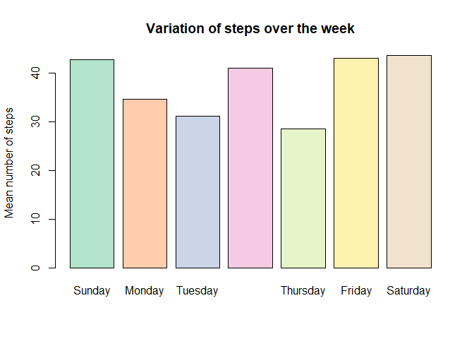
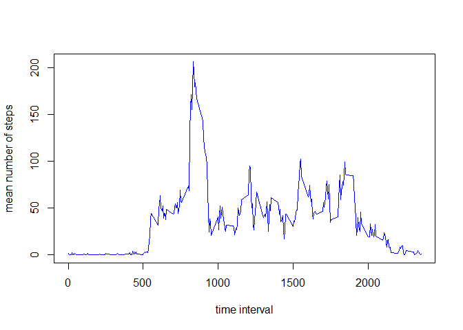
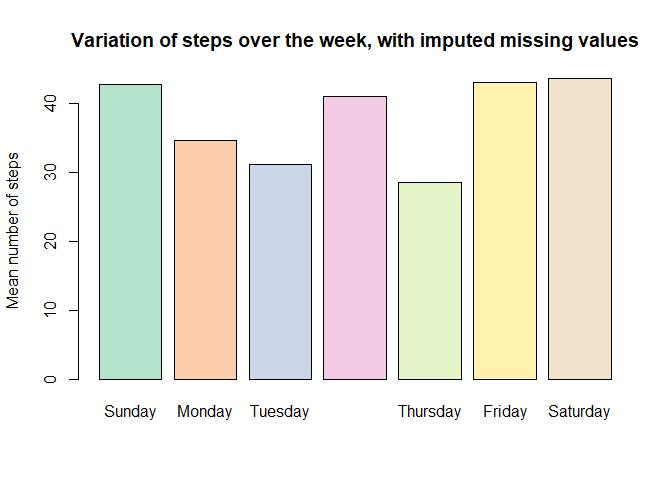
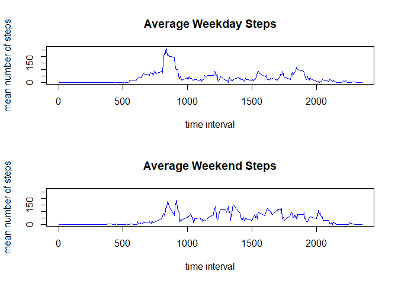

# Reproducible Research: Peer Assessment 1


## Loading and preprocessing the data


```r
library('dplyr')
```

```
## Warning: package 'dplyr' was built under R version 3.4.1
```

```
## 
## Attaching package: 'dplyr'
```

```
## The following objects are masked from 'package:stats':
## 
##     filter, lag
```

```
## The following objects are masked from 'package:base':
## 
##     intersect, setdiff, setequal, union
```

```r
library('RColorBrewer')

Activity <- read.csv ('activity.csv')

# Add a column for the week day, as a factor
Activity <- mutate(Activity, Day = as.factor(weekdays(as.Date(date))))
```

```
## Warning: package 'bindrcpp' was built under R version 3.4.1
```

```r
y<-tapply(Activity$steps, Activity$Day, mean) %>%as.data.frame()
z<- c(y['Sunday',], y['Monday',], y['Tuesday',], y['Wednesday',], y['Thursday',], y['Friday',])
```

The data has been loaded in from a zip file.


## What is mean total number of steps taken per day?

```r
# remove NA Values
ActivityNoNa <- Activity[!is.na(Activity$steps),]
# Calculate the mean for each day
yMean <- tapply(ActivityNoNa$steps, ActivityNoNa$Day, mean) %>%as.data.frame()
yMean <- c(yMean['Sunday',], yMean['Monday',], yMean['Tuesday',], yMean['Wednesday',], yMean['Thursday',], yMean['Friday',], yMean ['Saturday',])
# Plot a histogram of the data
barplot(yMean, col = brewer.pal(7, 'Pastel2'))
title(main = "Variation of steps over the week", ylab = 'Mean number of steps')
```

<!-- -->

```r
# Calculate the Medain in the same mannor
yMed<-tapply(ActivityNoNa$steps, ActivityNoNa$Day, median) %>%as.data.frame()
yMed<- c(yMed['Sunday',], yMed['Monday',], yMed['Tuesday',], yMed['Wednesday',], yMed['Thursday',], yMed['Friday',], yMed['Saturday',])
```

The plot above shows the variation of the mean number of steps per day, based on each day of the week.
The values for the the day by day means are:

```r
print(yMean%>%round(1))
```

```
##    Sunday    Monday   Tuesday Wednesday  Thursday    Friday  Saturday 
##      42.6      34.6      31.1      40.9      28.5      42.9      43.5
```
And the day by day medians are shown below:

```r
print(yMed%>%round(1))
```

```
##    Sunday    Monday   Tuesday Wednesday  Thursday    Friday  Saturday 
##         0         0         0         0         0         0         0
```
As so many of the times have 0 steps, the medians turn out to be 0.

## What is the average daily activity pattern?


```r
ActivityNoNa$interval<-as.factor(ActivityNoNa$interval)
yDay<-tapply(ActivityNoNa$steps, ActivityNoNa$interval, mean) %>% as.data.frame()
plot(as.numeric(row.names(yDay)), yDay[,1], type = 'l', lwd = 1.5, xlab = 'time interval', ylab = 'mean number of steps', col = 'blue')
```

<!-- -->

As can be seen above, the maximum number of steps occurs at the time interval of Tuesday


## Imputing missing values
The file contains 17568 rows of 4 observations.
Of the 17568 rows, 13% of the data records have NA values. 

In order to deal with the NA's I have replaced them with the average values of all inputs whcih had the same day and time interval as the missing value. This imputing has been done using a for loop, which is certintally not the most efficient method, but it doesnt take very long.


```r
# Duplicating the dataset as a new dataset with imputed rtows is required by the  question
ActivityI <- Activity
# Looping throuh all NA rows to impute them, based on the same Time and Day
for (i in which(is.na(ActivityI$steps))){
        d <- ActivityI$Day[i]
        t <- ActivityI$interval[i]
        ActivityI$steps[i] <- ActivityI$steps[ActivityI$Day == d & ActivityI$interval == t] %>%
                mean(na.rm = TRUE) %>%
                round(digits = 0)
}

# Calculate the mean for each day
yIMean <- tapply(ActivityI$steps, ActivityI$Day, mean) %>%as.data.frame()
yIMean <- c(yIMean['Sunday',], yIMean['Monday',], yIMean['Tuesday',], yIMean['Wednesday',], yIMean['Thursday',], yIMean['Friday',], yIMean['Saturday',] )
# Plot a histogram of the data
barplot(yIMean, col = brewer.pal(7, 'Pastel2'))
title(main = "Variation of steps over the week, with imputed missing values", ylab = 'Mean number of steps')
```

<!-- -->

```r
# Calculate the Medain in the same mannor
yIMed<-tapply(ActivityI$steps, ActivityI$Day, median) %>%as.data.frame()
yIMed<- c(yIMed['Sunday',], yIMed['Monday',], yIMed['Tuesday',], yIMed['Wednesday',], yIMed['Thursday',], yIMed['Friday',], yIMed['Saturday',])
```

To more closely compare the effect of imputing the missing vlaues, below are the vlues of the daily means, with NA's removed:


```r
print(yMean%>%round(1))
```

```
##    Sunday    Monday   Tuesday Wednesday  Thursday    Friday  Saturday 
##      42.6      34.6      31.1      40.9      28.5      42.9      43.5
```
And after the imputation:

```r
print(yIMean%>%round(1))
```

```
##    Sunday    Monday   Tuesday Wednesday  Thursday    Friday  Saturday 
##      42.6      34.6      31.1      40.9      28.5      42.9      43.5
```
Based on the fact that the imputation was caluated by taking daily averages, there is no change in the daily means.

Repeating for the medians:


```r
print(yMed%>%round(1))
```

```
##    Sunday    Monday   Tuesday Wednesday  Thursday    Friday  Saturday 
##         0         0         0         0         0         0         0
```


```r
print(yIMed%>%round(1))
```

```
##    Sunday    Monday   Tuesday Wednesday  Thursday    Friday  Saturday 
##         0         0         0         0         0         0         0
```

As can be seen, there is also no change to the median values of each day.

## Are there differences in activity patterns between weekdays and weekends?


# Add a column for the week or weekend, as a factor


```r
ActivityI$WEnd <- ifelse (ActivityI$Day %in% c('Saturday', 'Sunday'), 'weekend', 'week')

WeekDay<-tapply(ActivityI$steps[ActivityI$WEnd == 'week'], ActivityNoNa$interval[ActivityI$WEnd == 'week'], mean) %>%
        as.data.frame()

WeekEnd<-tapply(ActivityI$steps[ActivityI$WEnd == 'weekend'], ActivityNoNa$interval[ActivityI$WEnd == 'weekend'], mean) %>%
        as.data.frame()

rng <- range(WeekDay, WeekEnd)

par(mfrow = c(2, 1))

plot(as.numeric(row.names(WeekDay)), WeekDay[,1], type = 'l', lwd = 1.5,
     xlab = 'time interval', ylab = 'mean number of steps', ylim = rng,
     col = 'blue', main = 'Average Weekday Steps')

plot(as.numeric(row.names(WeekEnd)), WeekEnd[,1], type = 'l', lwd = 1.5,
     xlab = 'time interval', ylab = 'mean number of steps', ylim = rng,
     col = 'blue', main = 'Average Weekend Steps')
```

<!-- -->

I think that the two most obvious conclusions from the above plots are:
People spend less time sitting at a desk on the weekend, they move around all day
People get up later, and stay up later on the weekend!
